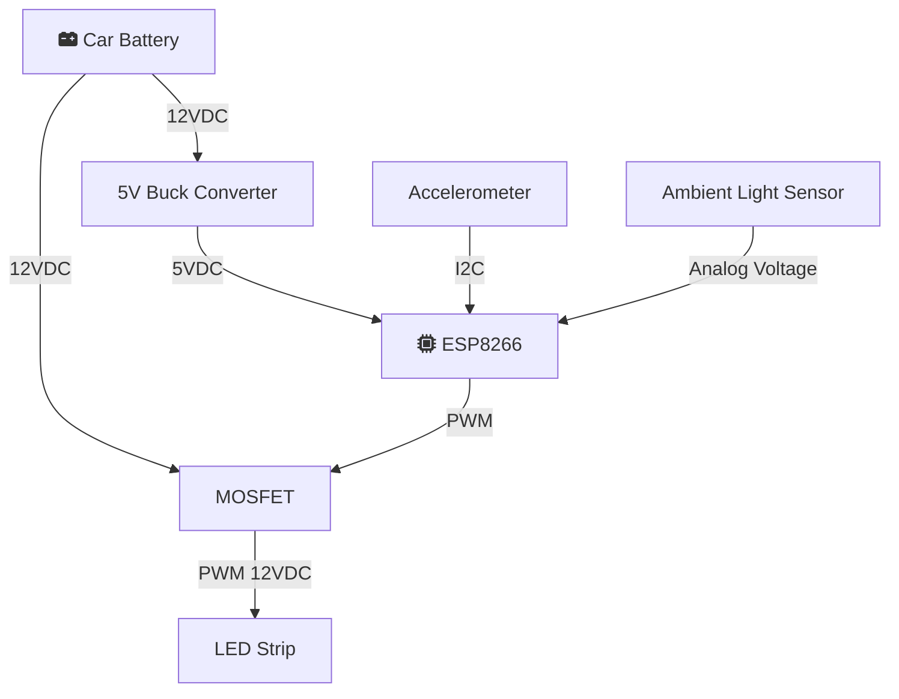

# ESP8266 Deceleration Brake Augmenter
> Auxiliary rear LED that brightens with deceleration using **ESP8266 + ADXL345** and an **ambient LDR**. Add‑on only — stock brake circuit untouched. Output is steady (no flashing) with smooth ramps.

## TL;DR
- Power-safe for 12 V automotive (fuse, reverse diode, TVS, buck).
- Reads decel from ADXL345, tilt-compensated and filtered.
- Ambient scaling via CdS photoresistor (Adafruit #161) on A0 with guardrails.
- Drives 12 V LED strip with low-side MOSFET via PWM (2–4 kHz).
- Small CLI to tune thresholds, gamma, floors, and filters.  
- Designed for **steady-burning** behavior (no flash) to align with FMVSS/VA norms.

---

## Photo: Overhead Console Install Area
*(example placement for the ambient sensor; shield from dome/map lights with a small hood)*


---

## Features
- Add-only; does **not** touch pedal/CAN or existing brake wiring.
- Gravity LPF + dynamic accel extraction; **jerk** + **slew** limiting.
- Ambient scaling bounded to safe range; updates only when nearly steady.
- EEPROM config with CRC; watchdog-friendly loop.
- Minimal dependencies (Wire, EEPROM).

## Hardware Overview
- **MCU:** ESP8266 (Wemos D1 mini / NodeMCU).  
- **IMU:** ADXL345 (3.3 V, I²C `0x53`).  
- **Ambient:** Adafruit #161 CdS LDR + 10 kΩ to GND, 1 kΩ series to A0, 0.1 µF A0→GND.  
- **Power:** Automotive 12 V → 5 V buck, 1 A fuse, reverse Schottky, TVS (SMBJ26A), LC filter.  
- **Driver:** Logic N‑MOSFET (e.g., FQP30N06L/IRLZ44N), 100 Ω gate, 100 kΩ pulldown; optional 100 Ω + 1 nF snubber.  
- **LED:** 12 V red LED strip (rear-facing).  
- **Connectors:** sealed, strain relief; star-ground at MOSFET source.

## Default Pinout (ESP8266)
| Function | Pin | Notes |
|---|---|---|
| I²C SDA | D2 | ADXL345 SDA |
| I²C SCL | D1 | ADXL345 SCL |
| PWM Out | D6 | MOSFET gate via 100 Ω |
| Ambient ADC | A0 | LDR node via 1 kΩ; 0.1 µF to GND |
| 3.3 V | 3V3 | ADXL345 + LDR divider |
| 5 V In | 5V | From buck |
| GND | G | Star ground to MOSFET source |

> **A0 Range:** Most dev boards scale A0 to **0–3.3 V**. Bare ESP8266 is **0–1.0 V**; if bare, add a divider (e.g., 240 kΩ/100 kΩ).

---

## Wiring Diagram (Mermaid)
> Logical layout; keep grounds star-connected, short I²C, and twisted LED supply if long.


---

## Build & Flash
1. **Arduino IDE** (or arduino-cli) with **ESP8266 core** installed.  
2. Board: *Wemos D1 mini* (or NodeMCU 1.0), CPU 80 MHz, 4M (1M SPIFFS/none).  
3. Clone this repo, open `src/main.cpp`.  
4. Verify the **pin defines** and **ADC range** flag near the top.  
5. Compile & Upload. Serial at **115200**.

### First Power-Up Checklist
- 12 V feed → **fuse** → **reverse diode** → **buck** → 5 V.  
- No LED connected yet: verify idle PWM ≈ 0 %, sensor logs stream.  
- Move the car or tilt the IMU: duty increases smoothly under decel.

---

## Configuration (Serial CLI)
Type a letter + params, then Enter:
```
p                        # print config
s                        # save defaults
t <min_g> <max_g> <γ>    # thresholds/gamma
f <day_floor> <night_floor>
a <amin> <amax> <tau_s>  # ambient scale & EMA
r <jerk_gps> <slew_s> <grav_tau_s>
```
**Recommended start:** `t 0.03 0.50 2.2`, `f 0.18 0.10`, `a 0.35 1.00 3.0`, `r 1.5 1.5 1.2`.

---

## Tuning Procedure
1. **Mounting:** IMU rigid, X forward; LDR behind 2–3 mm aperture with black tube to block dome/headlights.  
2. **Ambient:** Park day/night; adjust `a` caps so max scale is 1.0 (day) and min ~0.35 (night).  
3. **Thresholds:** Flat road coasting should be at floor; braking at city speeds should reach 80–100 %.  
4. **Slew/Jerk:** Increase if PWM still jitters over bumps.

---

## Safety & Legal Notes
- Output is **steady-burning** only; no flashing/wig‑wag.  
- Use **red** LED, rear-facing; do not impair required lamps.  
- Ensure robust power protection (fuse, TVS, reverse diode) and secure wiring (strain relief, IP67 enclosure where exposed).

---

## Troubleshooting
- **No ADXL345:** check I²C address `0x53`, wiring, 3.3 V.  
- **Flicker:** verify PWM freq (~3 kHz), add snubber if long LED leads, tighten grounds.  
- **Ambient swings:** increase `tau_s`, lower rate, and ensure the LDR is shaded from direct headlight/dome light.

---

## License & Disclaimer
- MIT. You are responsible for legality and safe installation in your jurisdiction. Keep behavior compliant with steady stop‑lamp norms.
