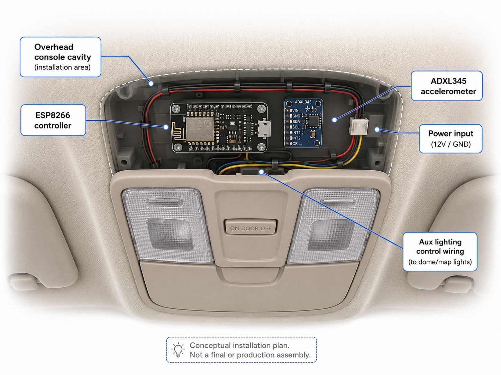
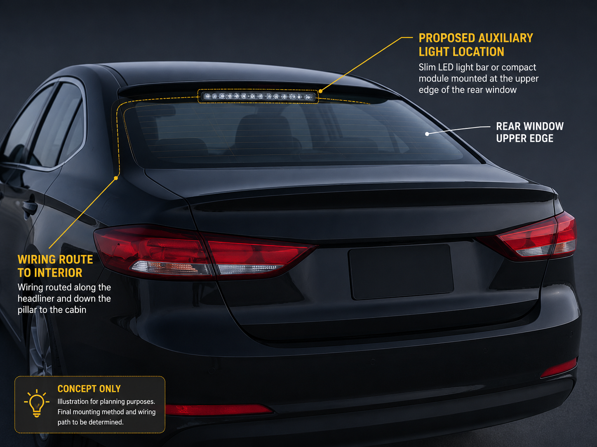
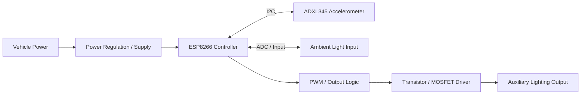
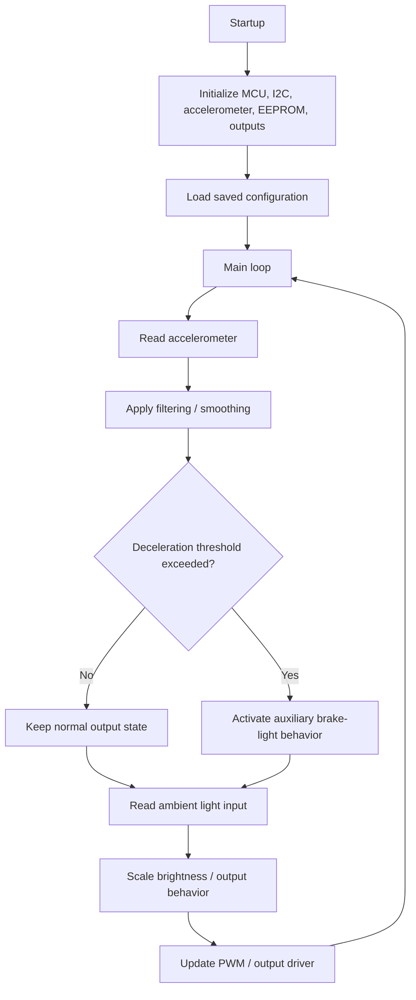

# vehicle-lighting-addon

An ESP8266-based auxiliary vehicle lighting controller that uses an accelerometer to detect deceleration and trigger additional brake-light behavior.

This project was built as an add-on lighting controller for a vehicle overhead console installation. It monitors motion using an ADXL345 accelerometer, applies filtering and threshold logic, and drives auxiliary lighting output based on deceleration events. Brightness can also be scaled using ambient light input.

## Purpose

This project exists to add smarter behavior to auxiliary vehicle lighting without replacing the factory brake light system.

The controller is intended to:

* detect meaningful deceleration events
* trigger an auxiliary brake-light output
* avoid false triggers from noise and vibration
* allow tuning through software
* support installation in a compact overhead-console form factor

## Features

* ESP8266-based controller
* ADXL345 accelerometer input
* deceleration-based brake light triggering
* filtered motion processing
* PWM output for lighting control
* EEPROM-backed configuration storage
* ambient light scaling support
* intended for compact in-vehicle installation

## Concept Images

### Overhead Console Electronics Area



### Rear Window Auxiliary Light Location



## Project Status

Functional prototype / hobbyist vehicle electronics project.

This is a practical personal project, not a commercial automotive product.

## Repository Structure

This project is structured around the Arduino IDE.

The main sketch file must remain:

`vehicle-lighting-addon.ino`

The Arduino IDE expects the sketch filename to match the folder name. Additional `.h`, `.c`, and `.cpp` files can be used, but the `.ino` file is still the primary entry point.

A simple structure like this is expected:

```text
vehicle-lighting-addon/
├── vehicle-lighting-addon.ino
├── README.md
├── LICENSE
├── docs/
│   ├── wiring-notes.md
│   └── tuning-notes.md
└── images/
    └── installation-overview.png
```

## Hardware Overview

### Main Components

* ESP8266 microcontroller
* ADXL345 accelerometer
* MOSFET or transistor-based lighting output stage
* vehicle power input
* optional ambient light input
* auxiliary lighting load

### Intended Installation Context

This project was designed around an overhead-console style installation, where the controller and accelerometer are mounted in the vehicle and connected to an auxiliary lighting output.

## System Diagram


```mermaid
flowchart LR
    VP[Vehicle Power] --> REG[Power Regulation / Supply]
    REG --> MCU[ESP8266 Controller]
    MCU <-- I2C --> ACCEL[ADXL345 Accelerometer]
    MCU <-- ADC / Input --> AMBIENT[Ambient Light Input]
    MCU --> PWM[PWM / Output Logic]
    PWM --> DRIVER[Transistor / MOSFET Driver]
    DRIVER --> AUX[Auxiliary Lighting Output]
```

## How It Works

The controller continuously reads acceleration data, filters it, and estimates whether the vehicle is undergoing significant deceleration.

If the measured deceleration exceeds a configured threshold, the controller activates the auxiliary lighting output. Ambient light input can be used to scale output brightness for day/night behavior.

## Decision / Processing Flow


```mermaid
flowchart TD
    START[Startup] --> INIT[Initialize MCU, I2C, accelerometer, EEPROM, outputs]
    INIT --> LOADCFG[Load saved configuration]
    LOADCFG --> LOOP[Main loop]

    LOOP --> READACCEL[Read accelerometer]
    READACCEL --> FILTER[Apply filtering / smoothing]
    FILTER --> CHECKDECEL{Deceleration threshold exceeded?}

    CHECKDECEL -- No --> NORMAL[Keep normal output state]
    CHECKDECEL -- Yes --> ACTIVATE[Activate auxiliary brake-light behavior]

    NORMAL --> READAMBIENT[Read ambient light input]
    ACTIVATE --> READAMBIENT

    READAMBIENT --> SCALE[Scale brightness / output behavior]
    SCALE --> UPDATE[Update PWM / output driver]
    UPDATE --> LOOP
```

## Installation Notes

This project is intended as an add-on controller, not a replacement for OEM brake-light circuitry.

Typical integration points may include:

* switched vehicle power
* ground
* auxiliary lighting output path
* accelerometer mounting point
* optional ambient light sensor input

### Important Installation Considerations

* Mount the accelerometer securely.
* Keep orientation consistent with the assumptions used in software.
* Protect the power input appropriately.
* Use a suitable driver stage for the lighting load.
* Confirm current draw, wiring size, and thermal limits.
* Avoid interfering with factory vehicle safety systems.

## Tuning

This project depends heavily on tuning and installation details.

Items that may need adjustment include:

* deceleration threshold
* filter constants
* trigger hold time
* PWM output level
* ambient brightness scaling
* accelerometer orientation and axis interpretation

Because different vehicles, mounting locations, and auxiliary lights behave differently, expect to perform some real-world tuning.

## Development Notes

This repo uses Arduino IDE conventions.

If you are opening this project in the Arduino IDE:

1. clone or download the repository
2. open `vehicle-lighting-addon.ino`
3. ensure the required libraries are installed
4. select the correct ESP8266 board
5. compile and upload

If you later want to split logic into additional source files, that is fine, but the `.ino` file should remain in place as the primary sketch entry point.

## Dependencies

At minimum, this project depends on:

* ESP8266 Arduino core
* ADXL345 library or direct support code
* EEPROM support
* standard Arduino framework functions

If you want, this section can later be updated with exact library names and versions.

## Safety and Legal Notes

This project controls vehicle lighting behavior. Use care.

* This project is provided for hobbyist and experimental use.
* It is not certified for road-legal or safety-critical applications.
* Vehicle lighting laws vary by location.
* The user is responsible for safe installation, legal compliance, and validation in their specific vehicle.
* No warranty is provided.

This project should be treated as an auxiliary add-on, not as a substitute for OEM braking, signaling, or safety systems.

## Known Limitations

* behavior depends on vehicle dynamics and mounting location
* accelerometer orientation matters
* false triggers are possible without proper tuning
* ambient light scaling depends on sensor choice and installation
* not validated as an automotive-grade production design

## Planned Improvements

Possible future improvements:

* cleaner hardware documentation
* installation illustration
* tuning guide with example values
* configuration reference
* sample logs or test data
* enclosure / bracket files
* links to related CAD or GrabCAD models

## License

This project is released under the MIT License.

You are free to use, modify, and adapt it for your own projects. No warranty is provided, and no ongoing support or maintenance is implied.
